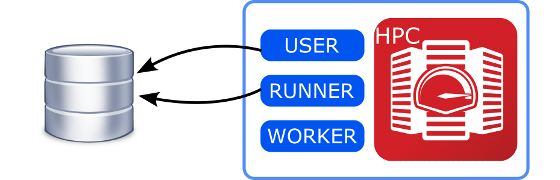
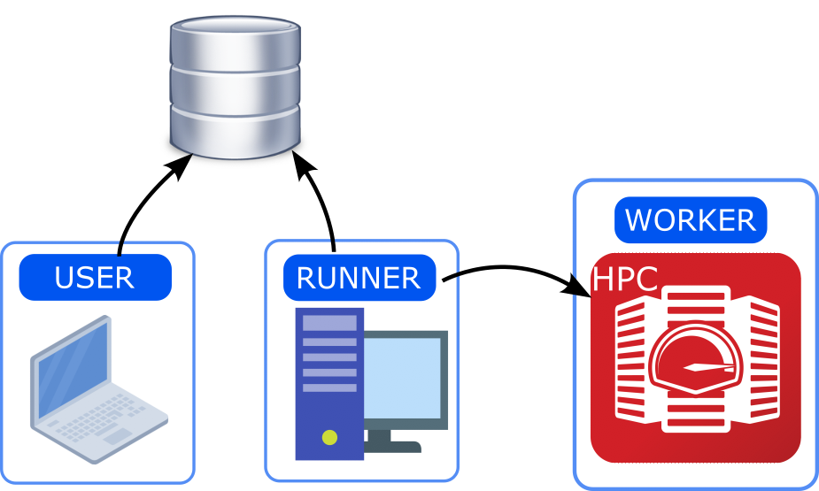

.. _install:

**********************
Setup and installation
**********************

Introduction
============

In order to properly set up ``jobflow-remote`` it is important to understand
the elements composing its structure.

There is a `MongoDB <https://docs.mongodb.com/manual>`_ database that
is used to store the state of the Jobs and their outputs.

We can then consider three environments involved in the Flows execution

* **USER**: The machine where the user creates new Flows and adds them to the DB.
  Also allows to check the state of the Jobs and analyse/fix failed ones.
* **RUNNER**: The machine where runs the ``runner`` daemon, taking care of advancing the state
  of the Jobs by copying files, submitting Jobs to workers and retrieving outputs.
* **WORKER**: The computing center, where the Jobs are actually executed.

All of these should have a python environment with at least jobflow-remote installed.
However, only **USER** and **RUNNER** need to have access to the database. If not overlapping
with the other **RUNNER** only needs ``jobflow-remote`` and its dependencies to be installed.

Setup options
=============

Depending on your resources and limitations imposed by computing centers you can
consider choosing among these three configurations:

.. _allinone config:

All-in-one
----------

**USER**, **RUNNER** and **WORKER** are the same machine.

If your database can be reached from the computing center and the daemon can
be executed on one of the front-end nodes, this is the simplest option.

.. _userworkstation config:

User-Workstation
----------------

**USER** and **RUNNER** are on a workstation external to the computing center with access
to the database, **WORKER** should be reachable with a passwordless connection from the workstation.

This is the most convenient option if the computing center does not have access to
the database.

.. image:: ../_static/img/configs_1split.png
   :width: 450
   :alt: All-in-one configuration
   :align: center

.. _fullsplit config:

Full-split
----------

**USER** can be the user's laptop/workstation. The **RUNNER** runs on a server that can keep
running and has access to the computing center (**WORKER**).

If preferring to work on a local laptop to generate new Flows and analyze outputs, but
couldn't let the daemon running on the same machine this could be a convenient solution.

Install
=======

``jobflow-remote`` is a Python 3.9+ library and can be installed using pip::

  pip install jobflow-remote

or, for the development version::

  pip install git+https://github.com/Matgenix/jobflow-remote.git

Environments
============

If the chosen configuration corresponds to :ref:`allinone config` a single python
environment can be created. A common way of doing so it to use an environment manager like `conda <https://docs.conda.io/projects/conda/en/stable/>`_
or `miniconda <https://docs.conda.io/projects/miniconda/en/latest/>`_, running::

      conda create -n jobflow python=3.10

and installing ``jobflow-remote`` and all the other packages containing the Flows to execute

For the :ref:`userworkstation config` and :ref:`fullsplit config` configurations the
environments need to be created on multiple machines. A convenient option consists in creating a conda
environment on one of the machines, like above. Then extracting all the installed
packages by running::

      conda env export > jobflow_env.yaml

And then use this list to generate equivalent environment(s) on the other machine(s)::

      conda env create -n env_name --file jobflow_env.yaml

.. warning::
  It is important that the packages version match between the different machines,
  especially for the packages containing the implemented Flows and Makers.

.. _minimal project config:

Configuration
=============

Jobflow-remote offers many configuration options, to customize both the daemon and the Job
execution. A full description of all the options can be found in the :ref:`projectconf` section.
Here we provide a minimal working example configuration to get started.

.. warning::
  Standard jobflow execution requires to define the out ``JobStore`` in the ``JOBFLOW_CONFIG_FILE``.
  Here, all the jobflow related configuration are given in the ``jobflow-remote`` configuration
  file and the content of the ``JOBFLOW_CONFIG_FILE`` will be **ignored**.

By default, jobflow-remote will search the projects configuration files in the ``~/.jfremote``.
In many cases a single project and thus configuration file would be enough, so
here we will not enter into the details of how to deal with multiple projects
configuration and other advanced settings.

You can get an initial setup configuration by running::

  jf project generate YOUR_PROJECT_NAME

For the sake of simplicity in the following the project name will be ``std``,
but there are no limitations on the name. This will create a file ``std.yaml`` in
your ``~/.jfremote`` folder with the following content:

.. literalinclude:: ../_static/code/project_simple.yaml
   :language: yaml

You can now edit the yaml file to reflect you actual configuration.

.. note::

  Consider that the configuration file should be accessible by the **USER** and the **RUNNER**
  defined above. If these are in two different machines be sure to also share the configuration
  file on both of them.

Workers
-------

Workers are the computational units that will actually execute the jobflow Jobs. If you are
in an :ref:`allinone config` configuration the worker ``type`` can be ``local`` and you do
not need to provide a host. Otherwise, all the information for an SSH connection should be
provided. In the example it is assumed that a passwordless connection can be established
based on the content of the ``~/.ssh/config`` file. The remote connection is based on
`Fabric <https://docs.fabfile.org/en/latest/>`_, so all of its functionalities can be used.

It is also important to specify a ``work_dir``, where all the folders for the Jobs execution
will be created.

.. _queue simple config:

Queue
-----

The connection details for the database that will contain all the information about the
state of Jobs and Flows. It can be defined in a way similar to the one used in ``jobflow``'s
configuration file. Three collections will be used for this purpose.

Jobstore
--------

The ``jobstore`` used for ``jobflow``. Its definition is equivalent to the one used in
``jobflow``'s configuration file. See `Jobflow's documentation <https://materialsproject.github.io/jobflow/stores.html>`_
for more details. It can be the same as in the :ref:`queue simple config` or a different one.

Check
-----

After all the configuration have been set, you can verify that all the connections
can be established by running::

  jf project check --errors

If everything if fine you should see something like::

  ✓ Worker example_worker
  ✓ Jobstore
  ✓ Queue store

Otherwise the python errors should also show up for the connections that failed.

As a last step you should reset the database with the command::

    jf admin reset

.. warning::

  This will also delete the content of the database. If are reusing an existing database
  and do not want to erase your data skip this step.

You are now ready to start running workflows with jobflow-remote!
