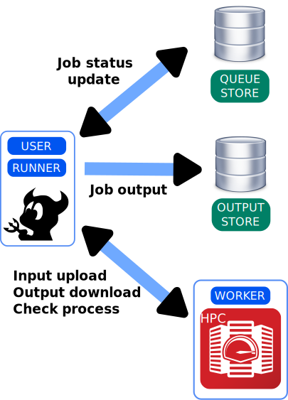

.. _introduction:

************
Introduction
************

Jobflow-remote is a free, open-source library serving as a manager for the execution
of `jobflow <https://materialsproject.github.io/jobflow/>`_ workflows. While jobflow is
not bound to be executed with a specific manager and some adapter has already been
developed (*e.g.* `Fireworks <https://materialsproject.github.io/fireworks/>`_),
jobflow-remote has been designed to take full advantage of and adapt to jobflow's
functionalities and interact with the typical high performance computing center
accessible by researchers.

Jobflow's Jobs functions are executed directly on the computing resources, however,
differently from `Fireworks <https://materialsproject.github.io/fireworks/>`_, all the
interactions with the output Stores are handled by a daemon process, called ``runner``.
This allows to bypass the problem of computing center not having direct access to the
user's database.
Given the relatively small requirements, this gives the freedom to run jobflow-remote's
daemon

* on a workstation that has access to the computing resource
* or directly on the front-end of the cluster

Here is a short list of the main jobflow-remote's features

* Fully compatible with `jobflow <https://materialsproject.github.io/jobflow/>`_
* Data storage based on mongo-like `maggma <https://materialsproject.github.io/maggma/>`_ Stores.
* Simple single file configuration as a starting point. Can scale to handle different projects with different configurations
* Fully configurable submission options
* Management through python API and command line interface
* Parallelized daemon execution
* Limit number of jobs submitted per worker
* Batch submission (experimental)

To better understand if jobflow-remote could be suitable for your use case, the
basic working principles are illustrated in the next section.

.. _workingprinciple:

Working principles
==================

Jobflow-remote orchestrates the execution of jobflow workflows. It is
important to understand that while each single Job is executed locally on the selected
worker, all the interaction with the DB and with the different workers are handled
by the ``runner`` daemon. This includes moving files from and to the worker, checking
the process status and inserting the outputs in the ``JobStore``.

Here we describe the general list of actions performed by the daemon.
Also refer to the list of :ref:`states` in which a Job can be. The following schematic
representation of the actions performed by the runner and their description below refers
to the :ref:`userworkstation config` configuration, but the steps are almost
equivalent for the other kinds of setup.

Once the daemon is started, the runner loops over the different actions that it can
perform and updates the state of Jobs in the database performing some actions on them.

* After a Job has been ``CHECKED_OUT``, the Runner will proceed to upload the information required to run a Job. This includes:

  - resolving all the references of the Job from the database (including everything in additional stores)
  - using those data to generate a JSON representation of the Job without external references
  - uploading a JSON file with this information on the runner

  Once this is done, the state of the Job is ``UPLOADED``.
* The runner generates a submission script suitable for the type of chosen worker.
  Uploads it and submits the job. The Job is now ``SUBMITTED``.
* When the SLURM job starts running, the code on the worker deserializes the Job object and
  executes its ``run`` method. Since all references are already resolved no access to the database
  is needed. The output of the Job is also stored as JSON files and does not need access the database.
* Meanwhile, the Runner keeps monitoring the state of the process (e.g. a SLURM job).
  When it is completed marks the Job as ``TERMINATED``.
* In the next step the Runner fetches the JSON file containing the outputs from the worker
  and sets the Job's state to ``DOWNLOADED``.

  .. note::

    This step is skipped if the Worker is a local worker.

* Finally, if everything went fine, the daemon inserts the output in the output ``JobStore``,
  marking the Job as ``COMPLETED``. Dependent Jobs are then set to ``READY``.

If some error arises during the execution of the above procedure the job will be marked accordingly
and the execution of the Job is stopped. Other Jobs depending on the failed one will typically
remain in the ``WAITING`` state.

In general, this approach requires that

* the machine hosting the runner has access to a persistent MongoDB database
* the machine hosting the runner can connect to the workers through an SSH connection
* the same Python environment is available on both the machine hosting the runner
  and on each of the workers
* a minimal starting configuration is provided in order to start executing jobs.
