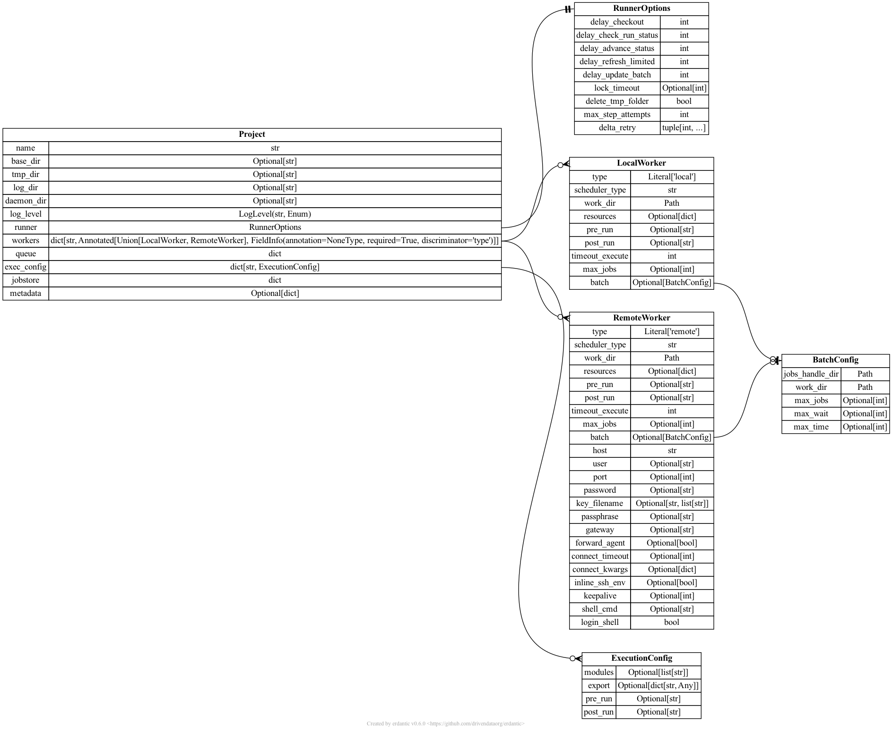

.. _projectconf:

***********************************
Projects configuration and Settings
***********************************

Jobflow-remote allows to handle multiple configurations, defined **projects**. Since
for most of the users a single project is enough let us first consider the configuration
of a single project. The handling of :ref:`projectconf multi` will be described below.

Aside from the project options, a set of :ref:`projectconf general` can be also be
configured through environment variables or an additional configuration file.

Project options
===============

The project configurations allow to control the behaviour of the Job execution, as well
as the other objects in jobflow-remote. Here a full description of the project's
configuration file will be given. If you are looking for a minimal example with its
description you can find it in the :ref:`minimal project config` section.

The specifications of the project's attributes are given by the ``Project`` pydantic
model, that serves the purpose of parsing and validating the configuration files, as
well as giving access to the associated objects (e.g. the ``JobStore``).
A graphical representation of the ``Project`` model and thus of the options available
in the configuration file is given below (generated with `erdantic <https://erdantic.drivendata.org/stable/>`_)

A description for all the types and keys of the project file is given in the :ref:`project detailed specs`
section below, while an example for a full configuration file can be generated running::

    jf project generate --full YOUR_PROJECT_NAME

Note that, while the default file format is YAML, JSON and TOML are also acceptable format.
You can generate the example in the other formats using the ``--format`` option.

Name and folders
----------------

The project name is given by the ``name`` attribute. The name will be used to create
a subfolder containing

* files with the parsed outputs copied from the remote workers
* logs
* files used by the daemon

For all these folders the paths are set with defaults, but can be customised setting

``tmp_dir``, ``log_dir`` and ``daemon_dir``.

.. warning::
  The project name does not take into consideration the configuration file name.
  For coherence it would be better to give use the project name as file name.

.. _projectconf worker:

Workers
-------

Multiple workers can be defined in a project. In the configuration file they are given
with their name as keyword, and their properties in the contained dictionary.

Several defining properties should be set in the configuration of each workers.
First it should be specified the ``type``. At the moment the possible worker types are

* ``local``: a worker running on the same system as the ``Runner``. No connection is
  needed for the ``Runner`` to reach the queueing system.
* ``remote``: a worker on a different machine than the ``Runner``, requiring an SSH
  connection to reach it.

Since the ``Runner`` needs to constantly interact with the workers, for the latter
type all the credentials to connect automatically should be provided. The best option
would be to set up a passwordless connection and define it in the ``~/.ssh/config``
file.

The other key property of the workers is the ``scheduler_type``. It can be any of the
values supported by the `qtoolkit <https://matgenix.github.io/qtoolkit/>`_. Typical
values are:

* ``shell``: the Job is executed directly in the shell. No queue will be used.
  If not limited, all the Jobs can be executed simultaneously
* ``slurm``, ``pbs``, ...: the name of a queueing system. The job will be submitted
  to the queue with the selected resources.

Another mandatory argument is ``work_dir``, indicating the full path for a folder
on the worker machine where the Jobs will be actually executed.

It is possible to optionally select default values for keywords like ``pre_run``
and ``resources``, that can be overridden for individual Jobs. Note that these
configurations will be applied to *all*  the Jobs executed by the worker. These
are thus more suitable for generic settings (e.g. the activation of a python
environment, or loading of some modules), rather than for the specific code
configurations. Those can better be set with the :ref:`projectconf execconfig`.

.. note::

    If a single worker is defined it will be used as default in the submission
    of new Flows.

.. _projectconf jobstore:

JobStore
--------

The ``jobstore`` value contains a dictionary representation of the standard
``JobStore`` object defined in jobflow. It can either be the serialized
version as obtained by the ``as_dict`` module or the representation defined
in `jobflow's documentation <https://materialsproject.github.io/jobflow/stores.html>`_.

This ``JobStore`` will be used to store the outputs of all the Jobs executed
in this project.

.. note::

    The ``JobStore`` should be defined in jobflow-remote's configuration file.
    The content of the standard jobflow configuration file will be ignored.

.. _projectconf queuestore:

Queue Store
-----------

The ``queue`` element contains the definition of the database containing the
state of the Jobs and Flows.  The subelement ``store`` should contain the
representation of a `maggma <https://materialsproject.github.io/maggma/>`_ ``Store``.
As for the ``JobStore`` it can be either its serialization or the same kind
of representation used for the ``docs_store`` in jobflow's configuration file.

The collection defined by the ``Store`` will contain the information about the
state of the ``Job``, while two more collections will be created. The name
of these two collections can also be customized.

.. warning::

    The queue ``Store`` should be a subclass of the ``MongoStore`` and currently
    it should be based on a real MongoDB (e.g. not a ``JSONStore``).
    Some key operations required by jobflow-remote on the collections are not
    supported by any file based MongoDB implementation at the moment.

.. _projectconf execconfig:

Execution configurations
------------------------

It is possible to define a set of ``ExecutionConfig`` objects to quickly set up
configurations for different kind of Jobs and Flow. The ``exec_config`` key
contains a dictionary where the keys are the names associated to the configurations
and for each a set of instruction to be set before and after the execution of the Job.

Runner options
--------------

The behaviour of the ``Runner`` can also be customized to some extent. In particular
the ``Runner`` implements an exponential backoff mechanism for retrying when an
operation of updating of a Job state fails. The amount of tries and the delay between
them can be set ``max_step_attempts`` and ``delta_retry`` values. In addition some
reasonable values are set for the delay between each check of the database for
different kind of actions performed by the ``Runner``. These intervals can be
changed to better fit your needs. Remind that reducing these intervals too much
may put unnecessary strain on the database.

Metadata
--------

While this does currently not play any role in the execution of jobflow-remote,
this can be used to include some additional information to be used by external
tools or to quickly distinguish a configuration file among others.

.. _projectconf multi:

Multiple Projects
=================

While a single project can be enough for most of the users and for beginners,
it may be convenient to define different databases, configurations and python
environments to work on different topics. For this reason jobflow-remote will
consider as potential projects configuration all the YAML, JSON and TOML files
in the ``~/.jfremote`` folder. There is no additional procedure required to
add or remove project, aside from creating/deleting a project configuration file.

.. warning::

    Different projects are meant to use different Queue Stores. Sharing the
    same collections for two projects is not a supported option.

To define the :ref:`projectconf queuestore` for multiple projects two options
are available:

* each project has its own database, with standard collection names
* a single database is used and each project is assigned a set of collections.
  For example, a configuration for one of the projects could be:

  .. code-block:: yaml

    queue:
      store:
        type: MongoStore
        database: DB_NAME
        collection_name: jobs_project1
        ...
      flows_collection: flows_project1
      auxiliary_collection: jf_auxiliary_project1

  And the same for a second project with different collection names.

There is no constrain for the database and collection used for the output
:ref:`projectconf jobstore`. Even though it may make sense to separate the
sets of outputs, it is possible to share the same collection among multiple
project. In that case the output documents will have duplicated ``db_id``,
as each project has its own counter. If this may be an issue it is possible
to set different ``db_id_prefix`` values in the ``queue`` configuration for
the different projects.

If more than one project is present and a specific one is not selected, the
code will always stop asking for a project to be specified. Python functions
like ``submit_flow`` and ``get_jobstore`` accept a ``project`` argument to
specify which project should be considered. For the command line interface
a general ``-p`` allows to select a project for the command that is being
executed::

    jf -p another_project job list

To define a default project for all the functions and commands executed on the
system or in a specific cell see the :ref:`projectconf general` section.

.. _project detailed specs:

Project specs
=============

.. raw:: html
   :file: ../_static/project_schema.html

.. _projectconf general:

General Settings
================

Aside from the project specific configuration, a few options can also be
defined in general. There are two ways to set these options:

* set the value in the ``~/.jfremote.yaml`` configuration file.
* export the variable name prepended by the ``jfremote`` prefix::

    export jfremote_project=project_name

.. note::

    The name of the exported variables is case-insensitive (i.e. JFREMOTE_PROJECT
    is equally valid).

The most useful variable to set is the ``project`` one, allowing to select the
default project to be used in a multi-project environment.

Other generic options are the location of the projects folder, instead of
``~/.jfremote`` (``projects_folder``) and the path to the ``~/.jfremote.yaml``
file itself (``config_file``).

Some customization options are also available for the behaviour of the CLI.
For more details see the API documentation :py:class:`jobflow_remote.config.settings.JobflowRemoteSettings`.
